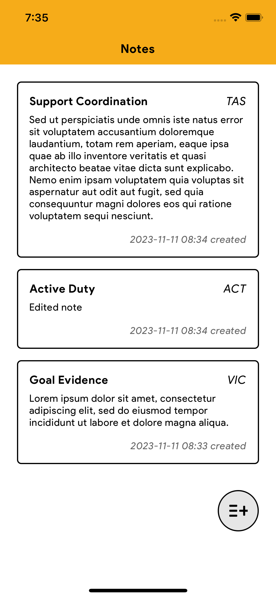
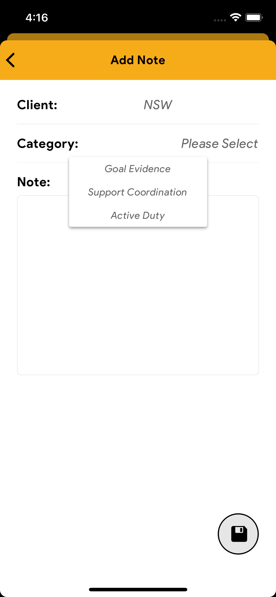
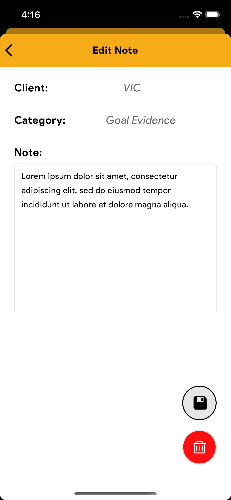
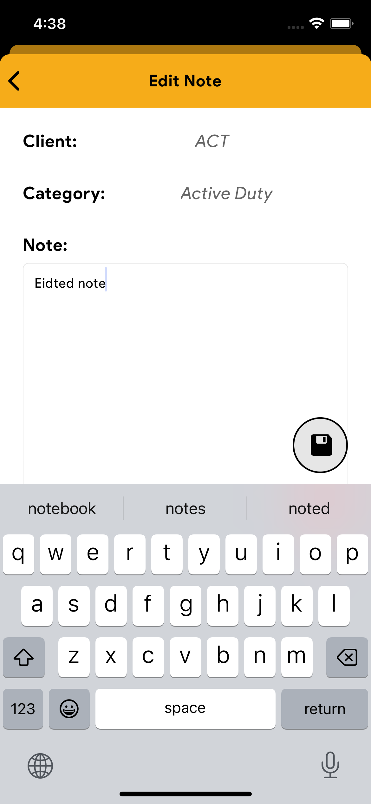

## 💃 Features
* Home Screen: Displays a list of notes. Tapping on a note navigates to the edit screen.
* Add Note Screen: Enables users to create notes and select a client, choose a category, and enter the note text.
* Edit Note Screen: Enables users to edit each fields of selected note or delete the note. 
* Error Handling: Not allow users to create a new note with missing field; The app shows a message if there is no note.
* Persist Data: All notes should be stored in local memory and persisted so that they are not lost when the user closes and reopens the app.

## 📱 Screenshots
  |  

  |  

## 🚀 How To Run

```
git clone https://github.com/RidicZhi/rn-note-app.git
cd rn-note-app
npm install
expo start
```
Then press 'i' to open iOS simulator, press 'a' open Android.

## 📗 Technology

* React Native / Expo 49.x
* React Native Navigation 6.x
* React Hooks
* Redux / RTK / Redux Persist
* Async Storage 
* Ant Design

## 👉🏼 Further Improvement

* This project was completed within a span of two nights(6 hours in total). Given an additional day, I would incorporate unit testing to enhance the project's robustness.

## 📰 License

This project is licensed under the MIT License - see the [LICENSE.md](LICENSE.md) file for details